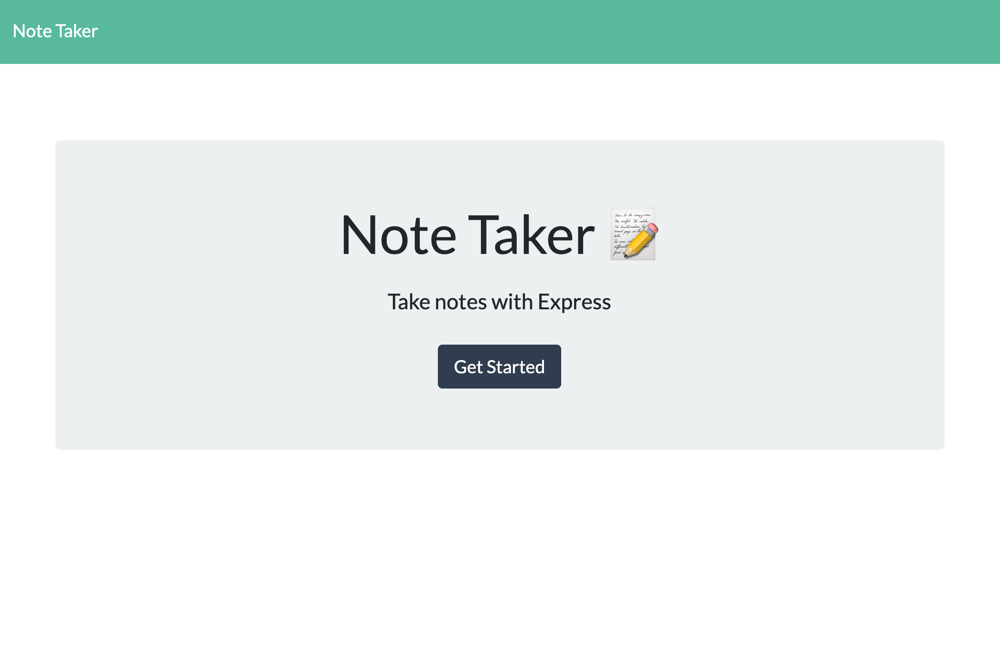
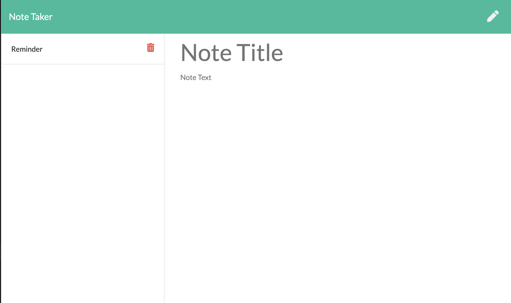
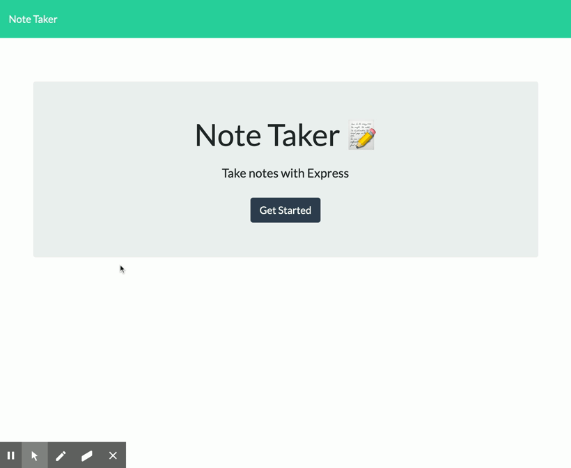

# Note Taker

Explore the [project page](https://github.com/cynthiwu/note-taker)

View it live on [Heroku](https://rocky-journey-04330.herokuapp.com/)

## Table of Contents
- [About The Project](#about-the-project)
    - [Built With](#built-with)
- [Installation](#installation)
- [Usage](#usage)
  - [Demo](#demo)
- [Contributing](#contributing)
- [License](#license)
- [Contact](#contact)


## About The Project

The goal of this project was to create an application whre the user can write, save and delete notes. It's easy to foget something, or recall something important. This application will help users keep track of a lot of information and record persistent notes to retrieve when needed. 

<hr>



<hr>



<hr>

### Built With

This project was built using:

* JavaScript
* jQuery
* [Node.js](https://nodejs.org/api/fs.html)
* [Express.JS](https://expressjs.com/)
* [Uniqid NPM](https://www.npmjs.com/package/uniqid)

## Installation

While not necessary to run the program via the live link above, you may get a local copy up and running by following these simple steps:

1. Clone the repo
```sh
git clone git@github.com:cynthiwu/note-taker.git 
```

2. Install NPM packages (i.e., Express.js)
```sh
npm install
```

To install individually, you may execute the following:
```sh
npm install --save express uniqid
```

## Usage

This project can be used by anyone wishing to save a note to be retrieved in the future. The user should get started by clicking the "Get Started" button on the home page. Simply enter a note "Tite" and note "Text" in the appropiate input fields. A "Save" button will appear on the nav bar. Click this button to save the note. Saved notes will appear on the lefthand side of the screen. To delete a note, simply click the red traschcan icon of the given note. 

### Demo

Watch the video below to see how the quiz works.




## Contributing

Contributions are what make the open source community such an amazing place to  learn, inspire, and create. Any contributions you make are **greatly appreciated**.

1. Fork the Project
2. Create your Feature Branch (`git checkout -b feature/AmazingFeature`)
3. Commit your Changes (`git commit -m 'Add some AmazingFeature'`)
4. Push to the Branch (`git push origin feature/AmazingFeature`)
5. Open a Pull Request

## License

None

## Contact

Cynthia Wu - [@cynthia21wu](https://twitter.com/cynthia21wu) - cynthia21wu@gmail.com

Project Link: [https://github.com/cynthiwu/note-taker](https://github.com/cynthiwu/note-taker)
